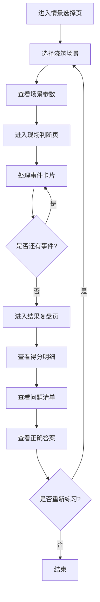

## 1. 产品概述

混凝土浇筑旁站情景练习——面向刚入职的监理员、工程管理学生和实习施工员的轻量训练型网页应用。用户通过选择不同浇筑场景，在模拟的现场情境中按时间顺序做出旁站判断，最终获得专业复盘评分，帮助新人在上岗前熟悉真实旁站流程。

- 解决新人缺乏现场经验、旁站流程不熟悉的问题
- 目标用户：监理员、工程管理学生、实习施工员

## 2. 核心功能

### 2.1 用户角色
| 角色 | 使用方式 | 核心权限 |
|------|----------|----------|
| 练习者 | 直接使用 | 浏览情景、做出判断、查看复盘 |

### 2.2 功能模块
1. **情景选择页**：场景卡片选择、场景参数展示（天气/部位/标号/泵送方式/人员配置）
2. **现场判断页**：时间线卡片流程、动作选择、理由填写、步骤进度
3. **结果复盘页**：评分展示、漏看资料提示、未留影节点、处置不规范之处、详细得分明细

### 2.3 页面详情
| 页面名称 | 模块名称 | 功能描述 |
|----------|----------|----------|
| 情景选择页 | 场景卡片 | 展示4种浇筑场景（地下室底板/框架柱/楼板/后浇带），点击选择进入 |
| 情景选择页 | 场景参数 | 显示选中场景的天气、浇筑部位、混凝土标号、泵送方式、现场人员配置 |
| 现场判断页 | 进度指示 | 显示当前步骤/总步骤，时间线进度条 |
| 现场判断页 | 事件卡片 | 按时间顺序呈现现场事件（罐车到场/坍落度检测/振捣检查/雨天浇筑等） |
| 现场判断页 | 动作选择 | 每个事件提供2-4个处理动作选项 |
| 现场判断页 | 理由填写 | 简短文本输入，说明选择该动作的理由 |
| 结果复盘页 | 总分展示 | 按旁站职责维度给出总分（0-100） |
| 结果复盘页 | 得分明细 | 分维度展示得分：资料查验/质量控制/安全防护/影像记录 |
| 结果复盘页 | 问题清单 | 列出漏看资料、未留影关键节点、处置不规范之处 |
| 结果复盘页 | 正确答案 | 展示每一步的标准处置和规范依据 |

## 3. 核心流程

用户进入情景选择页 → 选择浇筑场景 → 查看场景参数 → 进入现场判断页 → 按时间顺序处理事件卡片（选择动作+填写理由）→ 完成所有步骤 → 进入结果复盘页 → 查看得分/问题/正确答案 → 可重新选择场景练习

## 4. 用户界面设计

### 4.1 设计风格
- **主色调**：混凝土灰(#4A4A4A) + 安全橙(#FF6B35)作为强调色，搭配工程蓝(#2B5EA7)
- **次色调**：浅灰背景(#F5F5F0)、白色卡片、深灰文字
- **按钮风格**：圆角矩形，安全橙主按钮，灰色次要按钮
- **字体**：标题使用 Noto Sans SC Bold，正文使用 Noto Sans SC Regular
- **布局风格**：卡片式布局，顶部导航，居中内容区域
- **图标风格**：使用 Lucide 图标库，线性风格
- **整体风格**：工业/实用主义风格，模拟施工现场的严肃专业感，搭配微妙纹理

### 4.2 页面设计概览
| 页面名称 | 模块名称 | UI元素 |
|----------|----------|--------|
| 情景选择页 | 场景卡片 | 4张大型卡片，2×2网格，悬停提升效果，每张含图标+场景名+简介 |
| 情景选择页 | 场景参数 | 底部滑出面板，5个参数项横向排列，图标+标签+值 |
| 现场判断页 | 进度指示 | 顶部时间线，当前步骤高亮安全橙，已完成步骤打勾 |
| 现场判断页 | 事件卡片 | 居中大卡片，顶部事件标题+描述，中部动作选项（单选按钮组），底部理由输入框 |
| 现场判断页 | 导航按钮 | 底部"上一步""下一步"按钮，下一步仅在做出选择后激活 |
| 结果复盘页 | 总分展示 | 顶部大号分数显示，环形进度图 |
| 结果复盘页 | 得分明细 | 4列得分条，每列含维度名+进度条+分数 |
| 结果复盘页 | 问题清单 | 红色/黄色标记的问题卡片列表，含图标+描述+规范依据 |
| 结果复盘页 | 正确答案 | 折叠式详情，每步展开显示标准处置 |

### 4.3 响应式设计
- 桌面优先设计，最小宽度1024px
- 移动端适配：卡片单列布局，参数面板纵向排列
- 触摸优化：按钮最小44px触摸区域

### 4.4 3D场景
不适用
