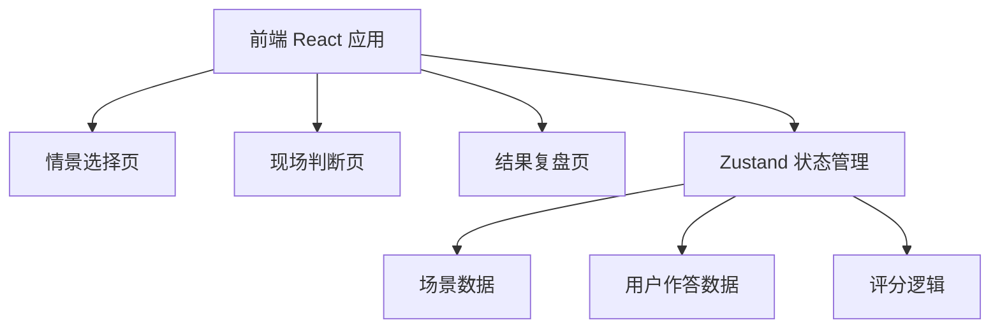
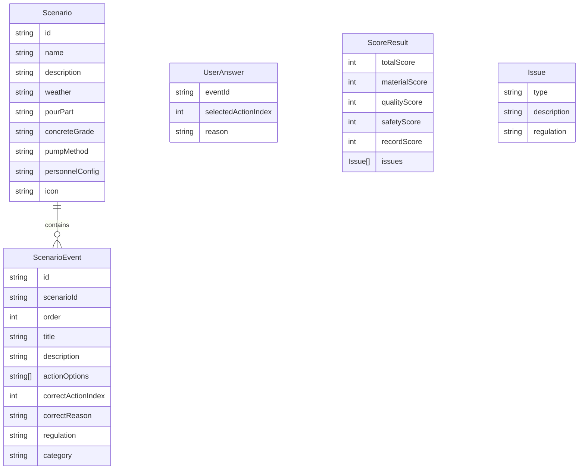

## 1. 架构设计

纯前端应用，无需后端服务。所有场景数据、评分逻辑均在前端内置。

## 2. 技术说明
- 前端：React@18 + TypeScript + TailwindCSS@3 + Vite
- 初始化工具：vite-init
- 后端：无
- 数据库：无，使用内置 Mock 数据
- 状态管理：Zustand
- 路由：react-router-dom

## 3. 路由定义
| 路由 | 用途 |
|------|------|
| / | 情景选择页，展示4种浇筑场景供选择 |
| /scenario/:id | 现场判断页，按时间顺序处理旁站事件 |
| /review/:id | 结果复盘页，展示得分和问题清单 |

## 4. API定义
不适用（纯前端应用）

## 5. 服务器架构图
不适用（纯前端应用）

## 6. 数据模型

### 6.1 数据模型定义

### 6.2 数据定义
使用 TypeScript 接口定义数据结构，内置在 `src/data/` 目录中：

- `scenarios.ts`：4种场景数据（地下室底板、框架柱、楼板、后浇带）
- `events.ts`：每个场景6-8个事件，按时间顺序排列
- `scoring.ts`：评分逻辑，按4个维度计算得分
